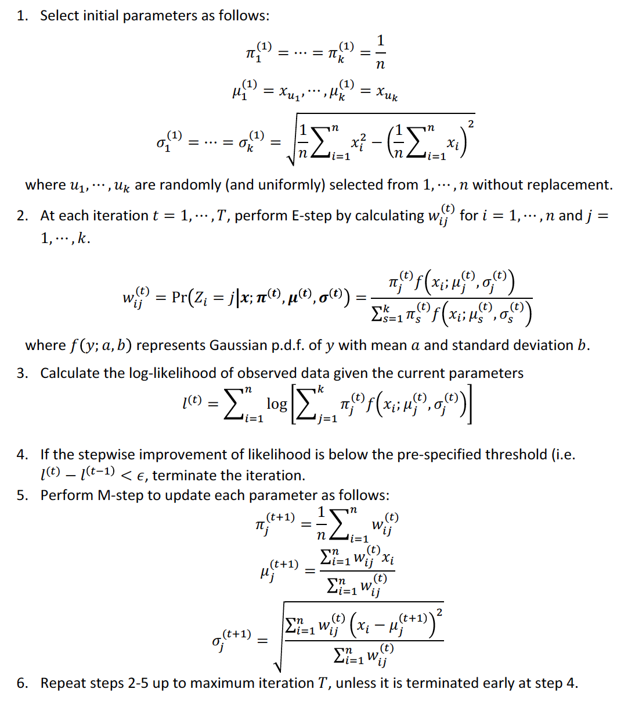

# Expectation-Maximization (EM) Algorithm 
Use C++ (RCpp) to implement the E-M algorithm two different ways. First, implement the full E-M algorithm based on the mathematical steps shown in the image below. Second, implement the E-M algorithm with the restricting assumption of uniform variance, meaning that each component has the same variance. Note that some mathematical derivation will need to be done in order to complete the second implementation. Both algorithms should have time complexity O(nkr), where k is the number of parameters, n is the size of the input data, and r is the number of iterations.

